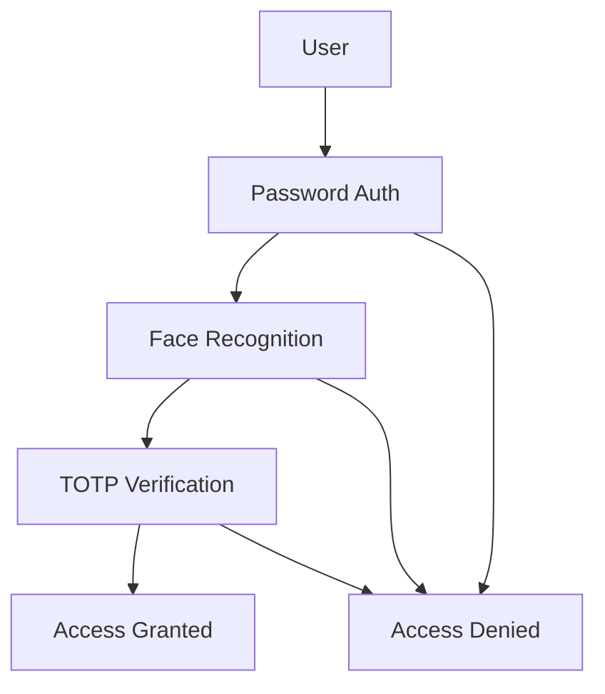
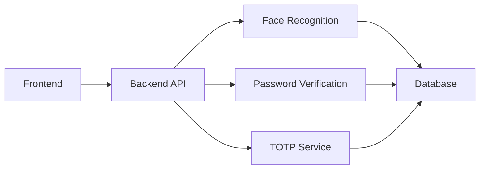
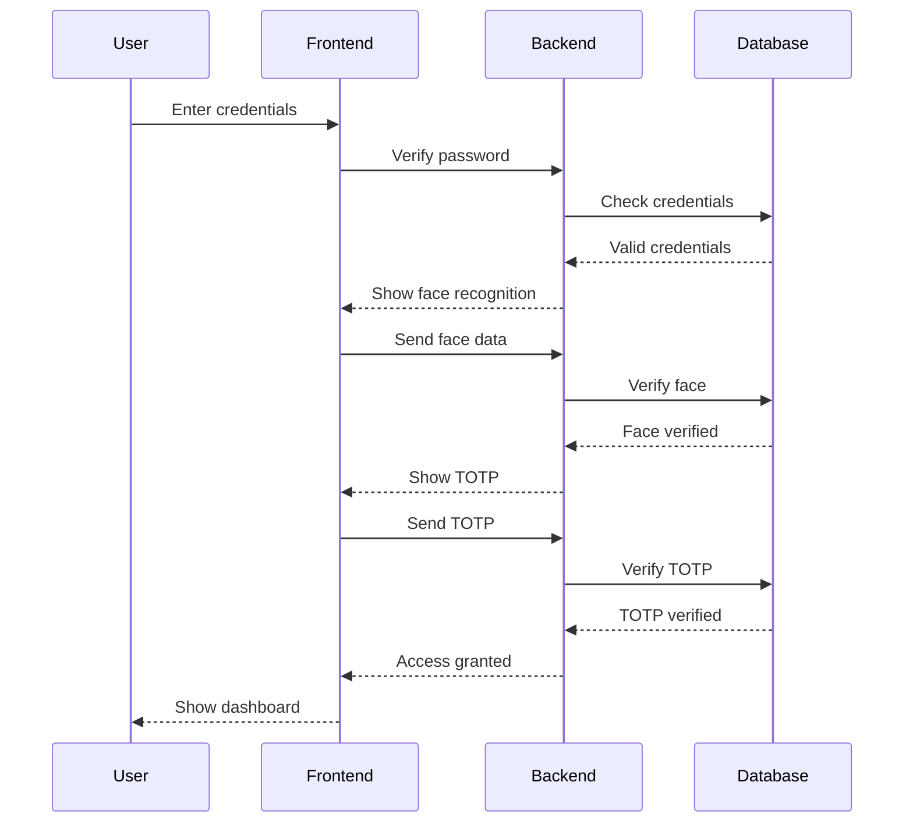

# 🔒 Secure Authentication Module for OS

A robust multi-factor authentication system that combines traditional password security with modern biometric verification and time-based OTP validation.


## 📋 Table of Contents
- [Overview](#overview)
- [Features](#features)
- [Architecture](#architecture)
- [Installation](#installation)
- [Usage](#usage)
- [Security](#security)
- [Contributing](#contributing)
- [Team](#team)

## 🌟 Overview

This project implements a secure authentication system with three layers of security:
1. Password-based authentication
2. Biometric face recognition
3. Time-based One-Time Password (TOTP)



## ✨ Features

### 🔑 Multi-Factor Authentication
- Password-based login
- Biometric face recognition
- Time-based OTP validation
- Secure session management

### 🎯 Key Capabilities
- Real-time face detection and verification
- QR code-based TOTP setup
- Secure password hashing
- Session management
- User-friendly interface

### 🛡️ Security Measures
- Password encryption
- Biometric data protection
- Rate limiting
- Session timeout
- Secure communication

## 🏗️ Architecture



## 🚀 Installation

1. Clone the repository:
```bash
git clone https://github.com/yourusername/secure-auth-module.git
cd secure-auth-module
```

2. Install frontend dependencies:
```bash
npm install
```

3. Install backend dependencies:
```bash
pip install -r requirements.txt
```

4. Set up environment variables:
```bash
cp .env.example .env
# Edit .env with your configuration
```

## 💻 Usage

1. Start the backend server:
```bash
python backend.py
```

2. Start the frontend development server:
```bash
npm start
```

3. Access the application at `http://localhost:3000`

### Authentication Flow



## 🔒 Security

### Password Security
- Passwords are hashed using bcrypt
- Salt is unique for each user
- Minimum password requirements enforced

### Biometric Security
- Face data is encrypted at rest
- Liveness detection implemented
- Secure storage of biometric templates

### TOTP Security
- Time-based one-time passwords
- 6-digit code with 30-second validity
- Rate limiting on verification attempts

## 👥 Team

### Core Developers
- **Cahal Agarwalla** - Full Stack Developer
  - [LinkedIn](https://linkedin.com/in/cahal-agarwalla)
  - [GitHub](https://github.com/CaHHaL)
  - [Twitter](https://x.com/CahalAgarwalla)

- **CahalAgarwalla** - Security Expert
  - [LinkedIn](https://www.linkedin.com/in/jagrati-dwivedi-0389a8289/)
  - [GitHub](https://www.linkedin.com/in/jagrati-dwivedi-0389a8289/)
  - [Twitter](https://www.linkedin.com/in/jagrati-dwivedi-0389a8289/)

## 🤝 Contributing

1. Fork the repository
2. Create your feature branch (`git checkout -b feature/AmazingFeature`)
3. Commit your changes (`git commit -m 'Add some AmazingFeature'`)
4. Push to the branch (`git push origin feature/AmazingFeature`)
5. Open a Pull Request

## 📝 License

This project is licensed under the MIT License - see the [LICENSE](LICENSE) file for details.

## 🙏 Acknowledgments

- React.js community for the excellent frontend framework
- Python community for the robust backend tools
- OpenCV for face recognition capabilities
- All contributors who have helped shape this project

---

Made with ❤️ by the Secure Authentication Module Team
